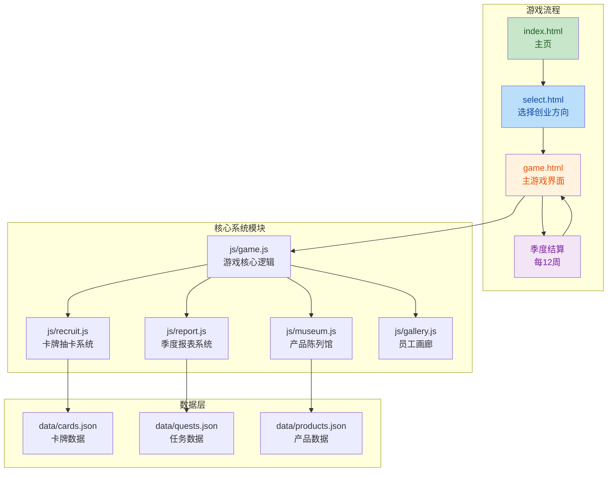
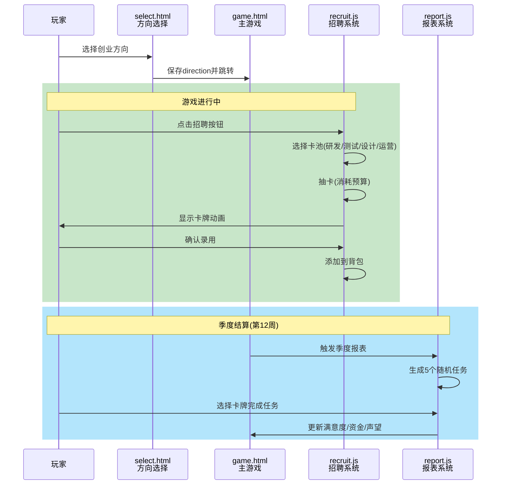

## 1. 高层摘要 (TL;DR)

*   **影响范围:** 🔴 **高** - 这是一个重大的游戏机制扩展,新增了多个核心系统
*   **主要变更:**
    *   ✨ 新增**创业方向选择系统** (To B / To C / B2C 三条路线)
    *   ✨ 新增**卡牌抽卡系统** (招聘员工,包含R/SR/SSR稀有度)
    *   ✨ 新增**季度报表系统** (每12周结算任务,影响满意度和资金)
    *   ✨ 新增**产品陈列馆** (解锁知名产品图鉴)
    *   ✨ 新增**银行借贷系统** (支持借钱和还款,有利息机制)
    *   ✨ 新增**声望系统** (影响抽卡成本、负债上限等)

---

## 2. 可视化概览 (代码与逻辑图)





---

## 3. 详细变更分析

### 🎮 3.1 核心游戏逻辑 (js/game.js)

**变更内容:**
-   新增**季度系统**: 定义 `QUARTER_DURATION = 12`,将游戏时间划分为季度
-   新增**声望系统**:
    -   `getFameLevel()`: 根据声望返回等级 (bad/low/normal/high/legendary)
    -   `getFameMultiplier()`: 声望影响资金结算倍率 (0.5x - 1.5x)
    -   `getDrawCostMultiplier()`: 声望影响抽卡成本 (0.7x - 1.5x)
    -   `getDebtLimit()`: 声望影响负债上限 (20 - 200)
    -   `getInterestRate()`: 声望影响贷款利率 (2% - 15%)
-   新增**借贷系统**:
    -   `borrowMoney(amount)`: 借钱,增加负债和预算
    -   `repayMoney(amount)`: 还款,减少负债和预算
    -   `calculateInterest()`: 计算周利息
-   新增**方向适配系统**: `directionTexts` 对象定义了 To B / To C / B2C 三条路线的文案差异
-   新增**胜利条件**: `triggerVictory()` - 当进度达到100%时触发胜利
-   修改**失败条件**: 移除连续低满意度失败,改为资金耗尽且负债满时失败

**关键代码片段:**
```javascript
// 声望系统示例
function getFameMultiplier() {
    const fame = gameState.fame;
    if (fame >= 80) return 1.5;
    if (fame >= 60) return 1.2;
    if (fame >= 40) return 1.0;
    if (fame >= 20) return 0.8;
    return 0.5;
}
```

### 🃏 3.2 卡牌抽卡系统 (js/recruit.js)

**变更内容:**
-   新增**卡池系统**: 4个卡池 (研发/测试/设计/运营)
-   新增**抽卡机制**:
    -   稀有度权重: R (6) > SR (3) > SSR (1)
    -   消耗预算: 基础10,受声望倍率影响
    -   HC限制: 最多3个员工(管培生不计)
-   新增**管培生机制**: 特殊卡牌,使用后触发随机事件(逆袭/转正/跑路/考公等)
-   新增**卡牌使用**: 卡牌有耐久度,使用后减少,耗尽销毁
-   新增**图鉴系统**: SSR卡牌解锁图鉴

**卡牌稀有度配置表:**

| 稀有度 | 权重 | 颜色 | 示例 |
|--------|------|------|------|
| R | 6 | #9ca3af (灰) | CRUD工程师 |
| SR | 3 | #22c55e (绿) | 架构师 |
| SSR | 1 | #eab308 (黄) | 算法专家 |

**管培生随机事件表:**

| 事件ID | 名称 | 结果 |
|--------|------|------|
| promote_ssr | 逆袭 | 晋升为SSR,奖励10预算 |
| promote_sr | 转正 | 晋升为SR,奖励5预算 |
| runaway | 跑路 | 卡牌消失,奖励3预算 |
| exam | 考公 | 卡牌消失,无奖励 |
| borrow | 借调 | 晋升为SR,奖励2预算 |
| nothing | 躺平 | 继续为R,耐久+1 |

### 📊 3.3 季度报表系统 (js/report.js)

**变更内容:**
-   新增**季度任务生成**: 每季度随机生成5个任务
-   新增**任务属性**:
    -   阵营: 天堂/地狱/G端/中立
    -   难度: easy/normal/hard/urgent
    -   基础分: 8-35分
-   新增**卡牌匹配机制**:
    -   同阵营卡牌: 1.5倍得分,无耐久损失
    -   G端卡牌: 1.3倍得分,无耐久损失
    -   不同阵营: 正常得分,耐久-1
-   新增**结算评级**:
    -   优秀 (≥40分): 满意度+10%, 资金+30, 声望+5
    -   合格 (≥20分): 满意度+5%, 资金+10, 声望+0
    -   不合格 (<20分): 满意度-10%, 资金-20, 声望-10

**任务难度配置表:**

| 难度 | 颜色 | 基础分范围 | 示例 |
|------|------|------------|------|
| easy | #22c55e (绿) | 8-10 | 文档编写 |
| normal | #3b82f6 (蓝) | 12-20 | 天堂需求变更 |
| hard | #f97316 (橙) | 30-35 | 架构评审 |
| urgent | #ef4444 (红) | 20-25 | 地狱Bug修复 |

### 🏛️ 3.4 产品陈列馆 (js/museum.js)

**变更内容:**
-   新增**产品图鉴**: 收集知名产品 (微信/抖音/淘宝/Salesforce等)
-   新增**解锁条件**: 根据游戏进度和方向解锁
-   新增**产品详情**: 展示创始人语录、用户评价、解锁文案

**产品解锁条件表:**

| 产品ID | 名称 | 方向 | 解锁条件 |
|--------|------|------|----------|
| wecom | 微信 | To C | 进度100% |
| douyin | 抖音 | To C | 进度100%且周数>24 |
| taobao | 淘宝 | To C | 进度100%且周数>48 |
| yonyou | 用友 | To B | 进度100% |
| salesforce | Salesforce | To B | 进度100%且周数>48 |
| pdd_platform | 拼多多平台 | B2C | 进度100% |

### 🎨 3.5 界面样式调整

**game.css 变更:**
-   调整状态栏布局: 从单行改为三列布局
-   增大字体: 状态项从10px增至18px
-   新增样式: `.status-columns`, `.status-column`, `.status-buttons`

**home.css 变更:**
-   新增陈列馆样式: `.museum-modal`, `.museum-content`, `.museum-card` 等
-   新增陈列馆详情: `.museum-detail-modal`, `.museum-detail-section`

**modals.css 变更:**
-   新增招聘模态框: `.recruit-modal`, `.pool-btn`, `.card-item`
-   新增报表模态框: `.report-modal`, `.report-quest-item`, `.report-preview`
-   新增借贷模态框: `.borrow-modal`, `.borrow-section`
-   新增卡牌动画: `.card-animation`, `.card-reveal`
-   新增Toast提示: `.toast-modal`, `.variant-toast`

### 📄 3.6 HTML结构变更

**game.html 变更:**
-   重构状态栏: 分为三列 (周数/PRD, 资金/负债, 声望/HC)
-   新增按钮: 招聘、借钱
-   新增模态框: 季度报表、招聘、招聘确认、卡牌动画、借贷

**index.html 变更:**
-   新增陈列馆按钮: `#btn-museum`
-   新增陈列馆模态框: `.museum-modal`, `.museum-detail-modal`

**select.html (新增):**
-   方向选择页面: To B / To C / B2C 三个选项
-   每个方向显示图标、描述、成功/失败结局

---

## 4. 影响与风险评估

### ⚠️ 4.1 破坏性变更

| 变更类型 | 影响 | 说明 |
|----------|------|------|
| 存档格式变更 | 🔴 高 | 新增 `direction`, `fame`, `debt`, `debtLimit` 等字段,旧存档可能不兼容 |
| 游戏流程变更 | 🟡 中 | 新增方向选择页面,旧存档会跳转到 `select.html` |
| 失败条件变更 | 🟡 中 | 移除连续低满意度失败,改为资金耗尽失败 |

### 🧪 4.2 测试建议

**功能测试:**
1.  ✅ 验证方向选择后游戏文案正确切换 (To B显示"甲方满意度",To C显示"用户满意度")
2.  ✅ 验证抽卡系统: 消耗预算、HC限制、稀有度概率
3.  ✅ 验证管培生随机事件: 6种结果都能触发
4.  ✅ 验证季度结算: 第12周触发,任务匹配机制,结算奖励
5.  ✅ 验证借贷系统: 借款/还款限制,利息计算
6.  ✅ 验证声望系统: 影响抽卡成本、负债上限

**边界测试:**
1.  ✅ 测试HC满时无法抽卡
2.  ✅ 测试负债满时无法借款
3.  ✅ 测试资金不足时无法抽卡
4.  ✅ 测试进度100%时触发胜利
5.  ✅ 测试资金耗尽且负债满时触发失败

**兼容性测试:**
1.  ✅ 测试旧存档是否能正常加载 (应跳转到方向选择)
2.  ✅ 测试localStorage数据迁移

---

## 5. 数据文件清单

| 文件 | 大小 | 用途 |
|------|------|------|
| data/cards.json | 293行 | 卡牌数据 (4个卡池,20张卡牌,6个管培生事件) |
| data/quests.json | 119行 | 任务数据 (12个任务,4个难度,4个阵营) |
| data/products.json | 131行 | 产品数据 (9个产品,3个方向) |

---

## 6. 新增文件清单

| 文件 | 类型 | 功能 |
|------|------|------|
| select.html | HTML | 方向选择页面 |
| js/recruit.js | JS | 招聘系统 (420行) |
| js/report.js | JS | 季度报表系统 (335行) |
| js/museum.js | JS | 产品陈列馆 (198行) |
| js/gallery.js | JS | 员工画廊 (156行) |

---

## 7. 修改文件清单

| 文件 | 主要变更 |
|------|----------|
| js/game.js | 新增季度/声望/借贷系统,修改失败条件 |
| game.html | 重构状态栏,新增4个模态框 |
| index.html | 新增陈列馆入口 |
| css/game.css | 调整布局和字体 |
| css/home.css | 新增陈列馆样式 |
| css/modals.css | 新增7个模态框样式 |

---

## 8. 删除文件清单

| 文件 | 原因 |
|------|------|
| game-pre.html | 功能已合并到 game.html |
