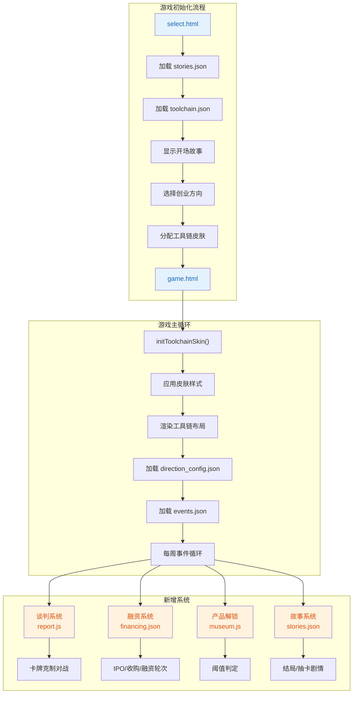
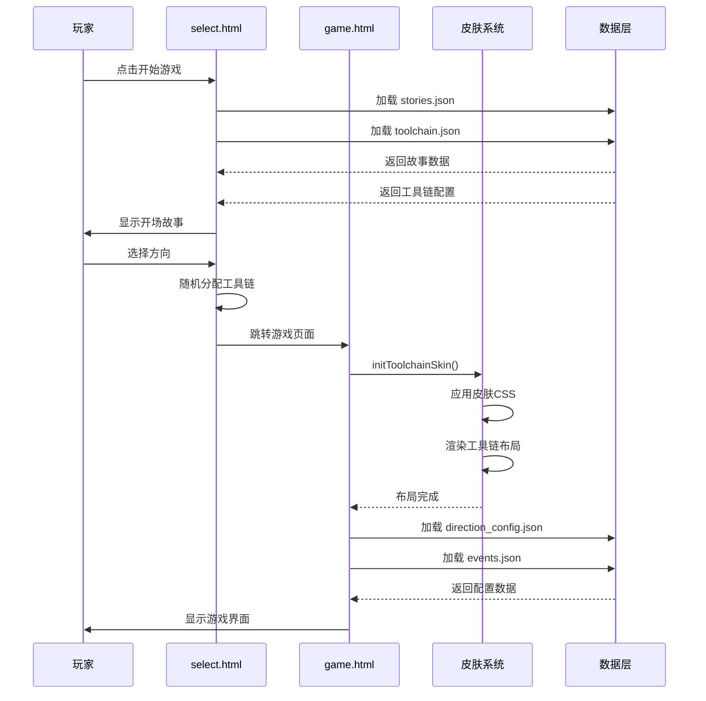

## 1. 高层摘要 (TL;DR)

**影响范围**: 🟢 **高** - 重大架构重构与功能扩展

**核心变更**:
- 🎨 **多皮肤系统**: 新增4款工具链皮肤(Jira/禅道/飞书/钉钉),完全重构UI渲染逻辑
- 📊 **业务数据重构**: 产品解锁机制从简单条件改为复杂阈值系统
- 🎴 **卡牌系统增强**: 新增职位属性、克制链、谈判对战玩法
- 📖 **叙事系统**: 新增故事模态框、结局文本、首次抽卡剧情
- 💰 **融资系统**: 新增IPO、收购、融资轮次与对赌机制
- 🗑️ **文档清理**: 删除过时文档(README/ROADMAP/playarr/style.md)

---

## 2. 可视化概览 (代码与逻辑图)





---

## 3. 详细变更分析

### 🎨 组件一: 多皮肤系统重构

#### **变更说明**
完全重构了游戏的UI渲染系统,从单一像素风格改为可切换的4款工具链皮肤。

#### **技术实现**

**新增文件**:
| 文件 | 皮肤类型 | 设计风格 | 适用方向 |
|------|---------|---------|---------|
| `css/skin-jira.css` | Jira | 深色系+看板布局 | To B |
| `css/skin-zentao.css` | 禅道 | 白色+表格布局 | To B |
| `css/skin-feishu.css` | 飞书 | 米色+文档布局 | To C |
| `css/skin-dingtalk.css` | 钉钉 | 蓝色+任务流布局 | B2C |

**核心函数** (`js/game.js`):
```javascript
function initToolchainSkin() {
    const toolchainId = localStorage.getItem(TOOLCHAIN_KEY);
    document.body.classList.add(`skin-${toolchainId}`);
    applyToolchainStyles(toolchain);
    renderToolchainLayout(toolchainId);
}

function renderJiraLayout() {
    // 渲染看板布局: To Do / In Progress / Done / Events
    mainArea.innerHTML = `<div class="jira-kanban">...</div>`;
}

function renderZentaoLayout() {
    // 渲染表格布局: 需求/任务/Bug
    mainArea.innerHTML = `<table class="task-table">...</table>`;
}
```

**数据配置** (`data/toolchain.json`):
```json
{
    "toolchains": {
        "jira": {
            "background": "#0a2a3a",
            "primary": "#1a3a4a",
            "accent": "#ffc107"
        }
    },
    "direction_default": {
        "tob": ["jira", "zentao"],
        "toc": ["feishu"],
        "b2c": ["dingtalk"]
    }
}
```

#### **CSS基础层变更** (`css/base.css`)
| 变更项 | 旧值 | 新值 | 说明 |
|-------|------|------|------|
| CRT效果 | `.crt-effect` 完整实现 | `display: none` | 移除复古效果 |
| 布局结构 | 单一容器 | 双wrapper结构 | 支持不同皮肤缩放 |
| 状态栏 | 固定样式 | 皮肤覆盖 | 由皮肤CSS完全控制 |

---

### 📊 组件二: 业务数据重构

#### **产品解锁机制** (`data/products.json`)

**旧机制**: 简单字符串条件
```json
{
    "id": "wecom",
    "unlock_condition": "To C路线，市场份额100%"
}
```

**新机制**: 多维度阈值系统
```json
{
    "id": "xiaohongshu",
    "direction": "toc",
    "unlock_thresholds": {
        "dau": 30,
        "user_duration": 20,
        "creator_rate": 5
    }
}
```

**判定逻辑** (`js/museum.js`):
```javascript
function calculateGameStats() {
    const stats = {
        direction: direction,
        week: week,
        progress: progress
    };

    if (direction === 'toc') {
        stats.dau = Math.round((progress * 10) + (week * 2));
        stats.user_duration = Math.round(15 + (progress * 0.4));
        stats.creator_rate = Math.round(3 + (avgFavor * 0.1));
    }
    // ... 其他方向计算

    return stats;
}

function checkAndUnlockProducts() {
    products.forEach(product => {
        const thresholds = product.unlock_thresholds || {};
        let allPassed = true;

        for (const [key, threshold] of Object.entries(thresholds)) {
            const actual = gameStats[key] || 0;
            if (actual < threshold) {
                allPassed = false;
                break;
            }
        }

        if (allPassed) {
            unlockProduct(product.id);
        }
    });
}
```

**阈值类型对照表**:
| 阈值键 | 中文名称 | 适用方向 | 判定规则 |
|--------|---------|---------|---------|
| `renewal_rate` | 续约率 | To B | ≥ 阈值 |
| `dau` | DAU(万) | To C | ≥ 阈值 |
| `gmv` | GMV(亿) | B2C | ≥ 阈值 |
| `dispute_rate` | 纠纷率(%) | B2C | ≤ 阈值 |

---

### 🎴 组件三: 卡牌系统增强

#### **新增职位属性** (`data/cards.json`)

```json
{
    "pools": [
        {
            "id": "rd",
            "name": "研发",
            "position": "RD",
            "cards": [
                {
                    "id": "rd_001",
                    "name": "增删改查",
                    "position": "RD",
                    "effect": {"type": "progress", "value": 3}
                }
            ]
        }
    ],
    "position_colors": {
        "RD": "#3b82f6",
        "QA": "#ef4444",
        "Design": "#8b5cf6",
        "Operation": "#22c55e"
    },
    "counter_chain": {
        "Operation": "Design",
        "Design": "QA",
        "QA": "RD",
        "RD": "Operation"
    }
}
```

#### **谈判对战系统** (`js/report.js`)

**核心流程**:
```javascript
function startNegotiation() {
    const opponentCards = generateOpponentCards();
    negotiationState = {
        playerCards: [...availableCards],
        opponentCards: opponentCards,
        playerScore: 0,
        opponentScore: 0,
        currentRound: 1
    };
    renderNegotiationModal();
}

function calculateBattleResult(playerCard, opponentCard) {
    const counterChain = cardsData.counter_chain;

    // 克制关系判定
    if (counterChain[playerCard.position] === opponentCard.position) {
        return { win: true, message: `${playerCard.position} 克制 ${opponentCard.position}！` };
    }

    // 战力比拼
    const playerPower = getCardPower(playerCard);
    const opponentPower = getCardPower(opponentCard);

    if (playerPower > opponentPower) {
        return { win: true, message: `战力比拼胜利！(${playerPower} vs ${opponentPower})` };
    }
}
```

**克制链关系**:
```
运营 → 设计 → 测试 → 研发 → 运营
```

---

### 📖 组件四: 叙事系统

#### **故事模态框** (`select.html`)

```html
<div class="story-modal" id="story-modal">
    <div class="story-content">
        <div class="story-close" onclick="closeStoryModal()">×</div>
        <h2 class="story-title" id="story-title">📝 创始人手记</h2>
        <div class="story-text" id="story-text"></div>
        <button class="story-button" id="story-button" onclick="handleStoryChoice()">开始创业</button>
    </div>
</div>
```

#### **抽卡剧情** (`js/recruit.js`)

```javascript
function showFirstDrawStory(callback) {
    const story = storiesData.card_stories.first_draw;
    modal.innerHTML = `
        <h2 class="story-title">${story.title}</h2>
        <div class="story-text">${story.intro}</div>
        <button onclick="closeFirstDrawStoryAndDraw()">开始招募</button>
    `;
}

function showSSRStory() {
    const story = storiesData.card_stories.ssr_draw;
    // 显示SSR降临特效
}
```

#### **结局文本** (`data/stories.json`)

```json
{
    "ending_stories": {
        "ipo": {
            "title": "🏛️ 上市敲钟",
            "stories": {
                "tob": "你的公司成功上市了！敲钟的那一刻...",
                "toc": "你的App火遍全国，公司顺利上市！...",
                "b2c": "你的平台成为了行业标杆，公司成功上市！..."
            }
        },
        "acquisition": { ... },
        "silent": { ... },
        "bankruptcy": { ... }
    }
}
```

---

### 💰 组件五: 融资系统

#### **融资轮次配置** (`data/financing.json`)

| 轮次 | 季度范围 | 融资金额 | 名声加成 | 对赌条款 |
|------|---------|---------|---------|---------|
| 天使轮 | Q1-Q3 | 50 | 10 | 无 |
| A轮 | Q3-Q6 | 200 | 20 | 满意度≥70% |
| B轮 | Q6-Q9 | 500 | 30 | 增长率≥100% |
| C轮 | Q9-Q12 | 1000 | 50 | 估值≥2000万 |

```json
{
    "rounds": [
        {
            "id": "series_a",
            "title": "A轮融资",
            "minQuarter": 3,
            "maxQuarter": 6,
            "amount": 200,
            "fameBonus": 20,
            "hasCovenant": true,
            "covenantType": "satisfaction",
            "covenantTarget": 70,
            "covenantText": "对赌条款：下季度满意度需达到70%以上"
        }
    ],
    "covenant_penalties": {
        "satisfaction": {"fame_loss": 15, "budget_loss": 30}
    }
}
```

#### **模态框样式** (`css/modals.css`)

```css
.ipo-modal, .acquisition-modal, .financing-modal {
    display: none;
    position: fixed;
    background: rgba(0, 0, 0, 0.9);
    z-index: 25000;
}

.financing-details {
    background: rgba(0, 0, 0, 0.5);
    padding: 15px;
    margin-bottom: 25px;
    border: 2px solid #333;
}

#financing-covenant {
    color: #ff9500 !important;
}
```

---

### 🗑️ 组件六: 文档清理

#### **删除的文档**

| 文件 | 内容 | 删除原因 |
|------|------|---------|
| `README.md` | 项目介绍、核心玩法、角色列表 | 内容过时,已迁移至新文档 |
| `ROADMAP.md` | 开发路线图、每周更新表格 | 开发计划已变更 |
| `playarr.md` | 游戏机制文档 | 机制已重构 |
| `style.md` | 技术开发文档、视觉规范 | 设计规范已更新 |

---

## 4. 影响与风险评估

### ⚠️ 破坏性变更

| 变更项 | 影响范围 | 兼容性 |
|--------|---------|--------|
| 产品解锁机制 | `museum.js` 完全重构 | ❌ 不兼容旧存档 |
| 卡牌数据结构 | 新增 `position` 字段 | ⚠️ 需要数据迁移 |
| UI渲染系统 | 新增皮肤系统 | ⚠️ 旧存档可能显示异常 |

### 🧪 测试建议

**优先级 P0 (必须测试)**:
- ✅ 四种皮肤切换功能(Jira/禅道/飞书/钉钉)
- ✅ 产品解锁阈值判定逻辑
- ✅ 谈判对战克制关系
- ✅ 融资轮次触发条件

**优先级 P1 (重要)**:
- ✅ 故事模态框显示与关闭
- ✅ SSR抽卡特效
- ✅ 对赌条款违约判定
- ✅ 旧存档加载兼容性

**优先级 P2 (建议)**:
- ✅ 不同方向的事件触发
- ✅ 结局文本显示
- ✅ 响应式布局适配

### 📊 数据迁移检查清单

- [ ] 验证旧存档中的卡牌数据是否包含 `position` 字段
- [ ] 检查 `gameState.toolchain` 是否存在,不存在则分配默认皮肤
- [ ] 确认 `gameState.direction` 与新配置文件匹配
- [ ] 验证产品解锁状态是否需要重新计算

---

## 5. 总结

本次变更是游戏的一次**重大架构升级**,主要围绕以下三个目标:

1. **视觉体验升级**: 从单一像素风格扩展为4款工具链皮肤,满足不同用户偏好
2. **游戏深度增强**: 新增谈判对战、融资对赌、阈值解锁等复杂机制
3. **叙事体验完善**: 添加开场故事、抽卡剧情、多结局文本,提升沉浸感

**技术亮点**:
- 皮肤系统采用CSS类名切换+动态渲染,性能优良
- 产品解锁使用多维度阈值,判定逻辑清晰
- 谈判系统引入克制链,增加策略深度

**潜在风险**:
- 旧存档兼容性需要特别关注
- 新增功能较多,需要充分测试

**建议后续优化**:
- 考虑添加皮肤切换功能,让用户自由选择
- 完善数据迁移脚本,确保平滑升级
- 补充缺失的文档(README/ROADMAP等)
