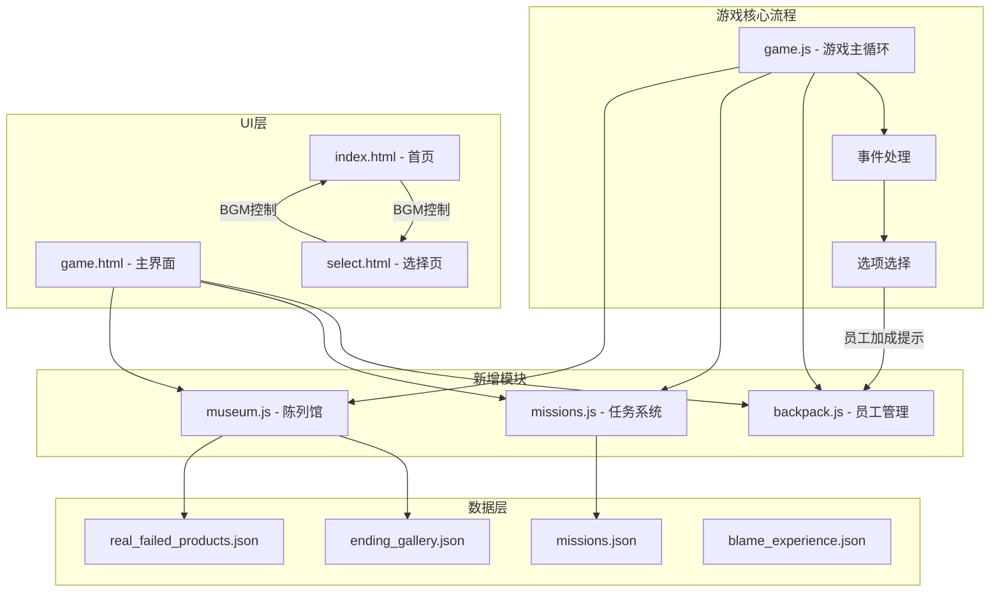
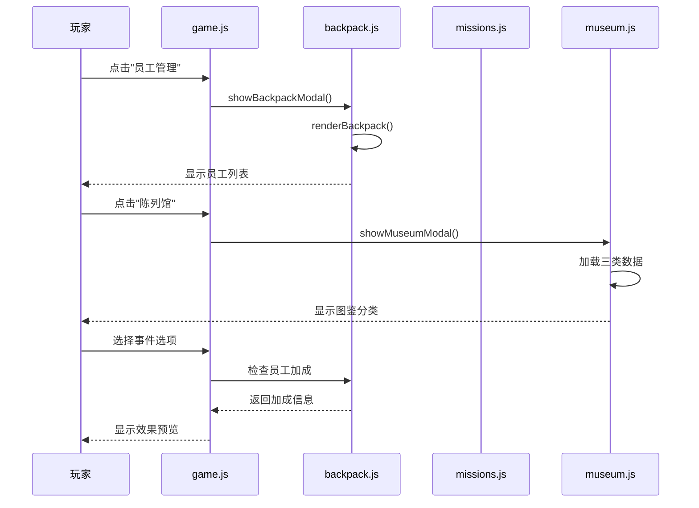

## 1. 高层摘要 (TL;DR)

**影响范围：** 🔴 **高** - 大幅扩展游戏玩法和内容系统

**核心变更：**
- ✨ **新增员工管理系统** - 支持员工背包、岗位筛选、耐久度管理
- 🎯 **新增任务系统** - 员工可执行任务获取奖励，含成功率和耐久消耗机制
- 🏛️ **陈列馆扩展** - 新增"结局图鉴"和"真实失败产品"两个分类
- 🎵 **背景音乐支持** - 在首页和选择页添加BGM控制
- 📊 **UI/UX优化** - 事件选项显示效果预览和员工加成提示

---

## 2. 视觉概览 (代码与逻辑映射)





---

## 3. 详细变更分析

### 📦 组件一：员工管理系统

**变更文件：** `js/backpack.js` (新增)

**核心功能：**
- 员工背包管理，支持按岗位筛选（研发/测试/设计/运营/产品）
- 显示员工稀有度（R/SR/SSR）、耐久度、培养状态
- HC限制显示和统计

**关键方法：**
| 方法名 | 功能 | 参数 |
|--------|------|------|
| `showBackpackModal()` | 显示员工管理模态框 | 无 |
| `filterBackpack(filter)` | 按岗位筛选员工 | filter: 岗位类型 |
| `renderBackpack(filter)` | 渲染员工列表 | filter: 岗位类型 |
| `getRarityStars(rarity)` | 获取稀有度星星 | rarity: R/SR/SSR |

---

### 🎯 组件二：任务系统

**变更文件：** `js/missions.js` (新增), `data/missions.json` (新增)

**核心功能：**
- 10个预设任务，覆盖5个岗位
- 任务执行机制：成功率计算、耐久消耗、效果应用
- 员工稀有度加成：SR +10%, SSR +20%

**任务数据结构：**

| 任务ID | 标题 | 岗位 | 难度 | 耐久消耗 | 成功率 |
|--------|------|------|------|----------|--------|
| mission_001 | 紧急Bug修复 | RD | 高 | 2 | 70% |
| mission_002 | 性能优化 | RD | 中 | 1 | 85% |
| mission_003 | 压力测试 | QA | 高 | 2 | 75% |
| mission_004 | 回归测试 | QA | 中 | 1 | 90% |
| mission_005 | 用户调研 | 运营 | 低 | 1 | 95% |
| mission_006 | 活动策划 | 运营 | 高 | 2 | 70% |
| mission_007 | UI改版 | 设计 | 中 | 1 | 85% |
| mission_008 | 品牌设计 | 设计 | 高 | 2 | 75% |
| mission_009 | 需求评审 | 产品 | 低 | 1 | 95% |
| mission_010 | PRD撰写 | 产品 | 中 | 1 | 85% |

**关键方法：**
```javascript
// 任务执行流程
assignMission(missionId, button) 
  → executeMission(mission, card)
    → 计算成功率 (基础 + 稀有度加成)
    → 消耗耐久度
    → 应用效果 (成功/失败)
    → 保存游戏状态
```

---

### 🏛️ 组件三：陈列馆扩展

**变更文件：** `js/museum.js`, `data/ending_gallery.json`, `data/real_failed_products.json`

**新增分类：**

| 分类 | 数据文件 | 解锁机制 | 数量 |
|------|----------|----------|------|
| 📦 产品图鉴 | `cards.json` | 达成阈值 | 原有 |
| 🎭 结局图鉴 | `ending_gallery.json` | 达成结局 | 11个 |
| 🏚️ 真实失败产品 | `real_failed_products.json` | 默认解锁 | 10个 |

**结局图鉴类型：**

| 类型 | 数量 | 示例 |
|------|------|------|
| 胜利结局 | 4个 | 上市敲钟、被大厂收购、事业成功、闷声发财 |
| 失败结局 | 7个 | 资金链断裂、App凉了、被甲方拉黑、平台崩盘等 |

**真实失败产品案例：**

| 产品 | 失败原因 |
|------|----------|
| 暴风影音 | 盲目多元化 + 资金链断裂 |
| 虾米音乐 | 集团战略摇摆 + 版权大战失败 |
| 快播 | 版权侵权 + 色情内容 |
| 人人网 | 错失移动转型 + 微信崛起 |
| 诺基亚手机 | 系统战略失误 + 拒绝Android |

---

### 🎵 组件四：背景音乐系统

**变更文件：** `index.html`, `select.html`

**功能特性：**
- 固定位置悬浮按钮（右下角）
- 点击切换播放/暂停状态
- 空格键快捷切换
- 音量设置为30%
- 循环播放 `assets/background/index.mp3`

**样式配置：**
```css
.bgm-toggle-btn {
    position: fixed;
    bottom: 30px;
    right: 30px;
    background: rgba(0, 0, 0, 0.95);
    border: 2px solid #ffd700;
    border-radius: 50%;
    width: 48px;
    height: 48px;
}
```

---

### 📊 组件五：UI/UX优化

**变更文件：** `css/base.css`, `css/game.css`, `js/game.js`

**布局优化：**

| 属性 | 旧值 | 新值 | 说明 |
|------|------|------|------|
| `body` 高度 | `min-height: 100vh` | `height: 100vh` | 固定高度 |
| `overflow` | `overflow-x: hidden` | `overflow: hidden` | 禁止滚动 |
| 主布局 | `transform: scale(0.9)` | `height: calc(100vh - 60px)` | 移除缩放 |
| 网格列数 | `1fr 300px` | `180px 1fr 240px` | 三列布局 |

**事件选项增强：**
- 显示效果预览（进度、满意度、名声、资金）
- 显示员工加成提示（有员工/需要员工）
- 加成效果百分比显示

**预算显示优化：**
```javascript
// 旧版本
document.getElementById('budget-value').textContent = gameState.budget;

// 新版本
const targetBudget = 10000;
const currentBudget = gameState.budget;
const percentage = ((currentBudget / targetBudget) * 100).toFixed(1);
document.getElementById('budget-value').textContent = 
    `${currentBudget.toLocaleString()}万 / ${targetBudget.toLocaleString()}万 (${percentage}%)`;
```

---

### 🎭 组件六：特殊事件模态框

**变更文件：** `css/pmf.css`, `css/blame.css`, `game.html`

**PMF关键事件模态框：**
- 三种增长路线选择：激进增长、深度变现、平衡发展
- 视觉效果：金色边框、发光动画
- 影响：DAU/LTV倍数调整

**甩锅大会模态框：**
- 三种甩锅策略：甩给团队、甩给外部、自己扛
- 视觉效果：红色边框、震动动画
- 数据支持：`blame_experience.json` 包含12条经验之谈

---

### 🎮 组件七：游戏状态扩展

**变更文件：** `js/game.js`

**新增字段：**

| 字段名 | 类型 | 说明 |
|--------|------|------|
| `pendingVariants` | Array | 待处理变体 |
| `totalReports` | Number | 总报表数 |
| `dau` | Number | 初始日活用户（10万） |
| `consecutiveZeroDauWeeks` | Number | 连续DAU=0周数 |
| `pmfReached` | Boolean | 是否达到PMF |
| `pmfChoiceMade` | Boolean | 是否做出PMF选择 |
| `growthStrategy` | String | 增长策略 |
| `dauMultiplier` | Number | DAU增长倍数 |
| `ltvMultiplier` | Number | LTV增长倍数 |
| `teamFavorCap` | Number | 团队好感度上限 |
| `blameMeetings` | Number | 甩锅大会次数 |
| `blameHistory` | Array | 甩锅历史 |
| `blameGrowthPoints` | Number | 甩锅成长点 |
| `blameExperiences` | Array | 已获得经验ID |
| `permanentEfficiencyPenalty` | Number | 永久效率降低 |
| `permanentDurabilityPenalty` | Number | 永久耐久度降低 |
| `blameMeetingActive` | Boolean | 甩锅大会进行中 |

---

## 4. 影响与风险评估

### ⚠️ 破坏性变更

| 变更类型 | 影响范围 | 说明 |
|----------|----------|------|
| **布局重构** | 全局 | 移除缩放，改用flex布局，可能影响皮肤CSS |
| **事件选项渲染** | 事件系统 | 选项渲染逻辑完全重写，依赖新CSS类 |
| **游戏状态结构** | 存档系统 | 新增多个字段，旧存档可能不兼容 |

### ✅ 测试建议

1. **员工管理测试：**
   - 验证岗位筛选功能
   - 检查耐久度显示和更新
   - 测试HC限制逻辑

2. **任务系统测试：**
   - 验证任务指派流程
   - 测试成功率和效果应用
   - 检查耐久消耗和离职机制

3. **陈列馆测试：**
   - 验证三个分类切换
   - 测试结局解锁逻辑
   - 检查详情模态框显示

4. **BGM测试：**
   - 验证播放/暂停切换
   - 测试空格键快捷键
   - 检查音量设置

5. **兼容性测试：**
   - 测试旧存档加载
   - 验证各皮肤CSS兼容性
   - 检查响应式布局

### 📝 注意事项

- **数据文件依赖：** 新增3个JSON数据文件，需确保路径正确
- **LocalStorage键名：** 新增3个存储键，需避免冲突
- **模态框层级：** PMF (35000) > 甩锅大会 (36000) > 陈列馆 (10015)
- **员工加成逻辑：** 需确保 `backpack` 全局变量正确初始化

---

## 5. 新增文件清单

| 文件路径 | 类型 | 说明 |
|----------|------|------|
| `js/backpack.js` | JavaScript | 员工管理系统 |
| `js/missions.js` | JavaScript | 任务系统 |
| `css/pmf.css` | CSS | PMF事件模态框样式 |
| `css/blame.css` | CSS | 甩锅大会模态框样式 |
| `data/missions.json` | JSON | 任务数据（10个任务） |
| `data/ending_gallery.json` | JSON | 结局图鉴数据（11个结局） |
| `data/real_failed_products.json` | JSON | 真实失败产品（10个案例） |
| `data/blame_experience.json` | JSON | 甩锅经验之谈（12条） |

---

**总结：** 本次更新大幅扩展了游戏的可玩性和内容深度，新增的员工管理、任务系统和陈列馆为玩家提供了更多策略选择和收集要素。UI/UX优化提升了游戏体验，但需要注意布局重构可能带来的兼容性问题。