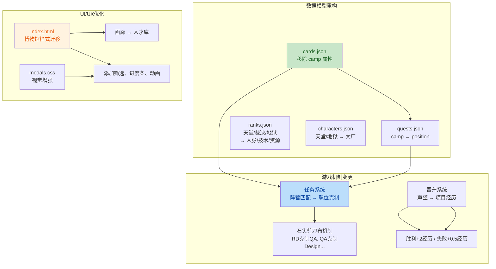
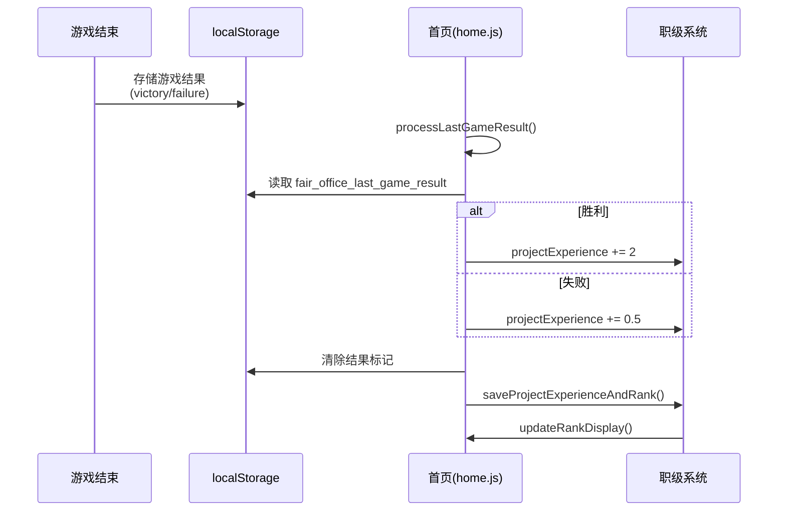

## 1. 高层摘要 (TL;DR)

**影响范围:** 🔴 **高** - 核心游戏机制重构,涉及数据模型、UI展示和游戏逻辑

**核心变更:**
- 🔄 **阵营系统 → 职位系统**: 将"天堂/地狱/裁决"阵营改为"RD/QA/Design/Operation"职位体系
- 📊 **声望 → 项目经历**: 将声望机制改为项目经历积累系统,职级晋升消耗项目经历
- 🎨 **图鉴系统重构**: 优化博物馆和人才库展示,添加筛选、进度统计和视觉增强
- ⚔️ **任务机制变更**: 从阵营匹配改为职位克制(石头剪刀布机制)
- 📝 **新增内容**: 添加大量ToC事件、真实失败产品和任务

---

## 2. 可视化概览 (代码与逻辑映射)





---

## 3. 详细变更分析

### 🎮 3.1 核心机制重构

#### 3.1.1 阵营系统 → 职位系统

**变更文件:** `data/cards.json`, `data/quests.json`, `js/report.js`

| 原阵营系统 | 新职位系统 | 说明 |
|-----------|-----------|------|
| `camp: "heaven"` | `position: "RD"` | 研发职位 |
| `camp: "hell"` | `position: "QA"` | 测试职位 |
| `camp: "justice"` | `position: "Operation"` | 运营职位 |
| `camp: "neutral"` | `position: "Design"` | 设计职位 |

**任务机制变更 - 石头剪刀布系统:**

```javascript
// js/report.js - 新增职位克制逻辑
function playRockPaperScissors(card, quest) {
    const counterChain = cardsData.counter_chain;
    // RD 克制 QA, QA 克制 Design, Design 克制 Operation, Operation 克制 RD
    if (counterChain[cardPosition] === questPosition) {
        win = true;
        score = Math.round(quest.base_score * 1.5); // 1.5倍得分
        message = `${cardPosition} 克制 ${questPosition}！完美解决！`;
    } else if (counterChain[questPosition] === cardPosition) {
        win = false;
        score = Math.round(quest.base_score * 0.5); // 0.5倍得分
        message = `${questPosition} 克制 ${cardPosition}！效果打折...`;
    } else {
        // 势均力敌,70%概率成功
        const randomResult = Math.random();
        if (randomResult > 0.3) {
            win = true;
            score = quest.base_score;
        } else {
            win = false;
            score = Math.round(quest.base_score * 0.3);
        }
    }
}
```

#### 3.1.2 声望 → 项目经历系统

**变更文件:** `data/ranks.json`, `js/home.js`, `js/game.js`, `script.js`

| 属性 | 旧值 | 新值 |
|------|------|------|
| 存储键 | `PRESTIGE_KEY` | `PROJECT_EXPERIENCE_KEY` |
| 变量名 | `prestige` | `projectExperience` |
| 职级属性 | `tian`, `jue`, `di` | `network`, `tech`, `resource` |
| UI标签 | "天堂/裁决/地狱" | "人脉/技术/资源" |
| 晋升消耗 | 声望值 | 项目经历 |

**职级系统对比:**

| 职级ID | 旧名称 | 新名称 | 人脉 | 技术 | 资源 | 消耗 |
|--------|--------|--------|------|------|------|------|
| p5 | P5 | 初级PM | 1-1 | 1-1 | 1-1 | 0 |
| p6 | P6 | 中级PM | 2-1 | 1-2 | 1-2 | 2 |
| p7 | P7 | 高级PM | 2-2 | 2-1 | 2-1 | 5 |
| p8 | P8 | 资深PM | 3-1 | 2-2 | 2-2 | 9 |
| p9 | P9 | 专家PM | 3-2 | 3-1 | 3-1 | 14 |
| p10 | P10 | 架构师 | 4-1 | 3-2 | 3-2 | 20 |

**项目经历获取机制:**

```javascript
// js/home.js - 处理游戏结果
function processLastGameResult() {
    const lastGameResult = localStorage.getItem('fair_office_last_game_result');
    if (!lastGameResult) return;
    
    localStorage.removeItem('fair_office_last_game_result');
    
    if (lastGameResult === 'victory') {
        projectExperience += 2; // 胜利获得2个项目经历
        showToast('🎉 项目胜利！获得2个项目经历');
    } else if (lastGameResult === 'failure') {
        projectExperience += 0.5; // 失败获得0.5个项目经历
        showToast('😢 项目失败...获得0.5个项目经历');
    }
    
    saveProjectExperienceAndRank();
    updateRankDisplay();
}
```

#### 3.1.3 ToC模式LTV单位调整

**变更文件:** `js/game.js`

| 指标 | 旧值 | 新值 | 说明 |
|------|------|------|------|
| 初始LTV | 2元 | 0.01万元 | 100元 |
| PMF阈值 | LTV≥20元 | LTV≥0.05万元 | 500元 |
| 深度变现 | LTV>200元 | LTV>0.1万元 | 1000元 |
| 平衡发展 | LTV>50元 | LTV>0.05万元 | 500元 |
| 收入计算 | `dau * 10000 * ltv * (90/365)` | `dau * ltv * 90` | 单位统一为万元 |

---

### 🎨 3.2 UI/UX优化

#### 3.2.1 博物馆系统重构

**变更文件:** `index.html`, `css/modals.css`, `js/museum.js`

**新增功能:**
- ✅ 多维度筛选(类型、方向、状态)
- ✅ 成功/失败产品合并展示
- ✅ 视觉增强(渐变、阴影、动画)
- ✅ 解锁条件悬浮提示

**筛选系统架构:**

```javascript
// js/museum.js - 筛选状态管理
let currentFilter = {
    type: 'products',      // products / endings
    direction: 'all',      // all / toc / tob / b2c
    status: 'all',         // all / unlocked / locked
    productType: 'all'     // all / success / failed
};
```

**视觉效果增强:**
- 模态框背景透明度: 0.8 → 0.9
- 添加 `backdrop-filter: blur(8px)` 模糊效果
- 卡片悬停动画: `transform: translateY(-8px) scale(1.02)`
- 卡片发光动画: `@keyframes cardGlow`
- 淡入动画: `@keyframes fadeIn`

#### 3.2.2 人才库(画廊)系统重写

**变更文件:** `js/gallery.js`, `css/modals.css`

**新增功能:**
- ✅ 卡牌筛选(职位、稀有度、状态)
- ✅ 收集进度统计和进度条
- ✅ 卡牌详情弹窗
- ✅ 未解锁卡牌提示

**筛选UI结构:**

```javascript
// js/gallery.js - 筛选标签生成
htmlContent += '<div class="gallery-tabs">';
htmlContent += '<div class="gallery-tab-row"><span class="filter-label">职位:</span>...';
htmlContent += '<div class="gallery-tab-row"><span class="filter-label">稀有度:</span>...';
htmlContent += '<div class="gallery-tab-row"><span class="filter-label">状态:</span>...';
htmlContent += '</div>';

htmlContent += '<div class="gallery-stats">';
htmlContent += '<div class="stat-header"><span class="stat-label">卡牌收集</span>...';
htmlContent += '<div class="stat-progress-bar"><div class="stat-progress-fill" style="width: ' + progress + '%"></div></div>';
htmlContent += '</div>';
```

#### 3.2.3 CSS样式优化

**变更文件:** `css/home.css`, `css/modals.css`

| 样式变更 | 说明 |
|---------|------|
| 移除 `text-stroke` | 非标准属性,仅保留 `-webkit-text-stroke` |
| 添加 `.museum-scroll-container` | 博物馆滚动容器,隐藏滚动条 |
| 添加 `.gallery-scroll-container` | 画廊滚动容器,隐藏滚动条 |
| 增强 `.gallery-item` | 渐变背景、圆角、阴影、动画 |
| 新增 `.gallery-stats` | 统计信息容器 |
| 新增 `.gallery-tabs` | 筛选标签容器 |
| 新增 `.stat-progress-bar` | 进度条样式 |

---

### 📊 3.3 数据内容扩展

#### 3.3.1 新增ToC事件

**变更文件:** `data/events.json`

新增18个ToC方向事件 (event_toc_005 ~ event_toc_022):

| 事件ID | 事件名称 | 主要影响 |
|--------|---------|---------|
| event_toc_005 | KOL负面测评 | 满意度-5, 预算-20 |
| event_toc_006 | 竞品功能抄袭 | 进度+15, 预算-25 |
| event_toc_007 | 服务器崩溃 | DAU-10, 预算-30 |
| event_toc_008 | 用户数据泄露 | 满意度-15, 预算-35 |
| event_toc_009 | 网红推荐产品 | DAU+40, 预算-50 |
| event_toc_010 | 产品上热搜 | DAU+50, 预算-80 |
| event_toc_011 | 社区内容违规 | 满意度-5 |
| event_toc_012 | 新功能反响平平 | 进度+5 |
| event_toc_013 | 支付通道故障 | 满意度-5 |
| event_toc_014 | 用户UGC爆发 | 满意度+10, 预算-25 |
| event_toc_015 | 节假日用户暴增 | DAU+25, 预算-40 |
| event_toc_016 | 竞争对手融资 | 进度+15 |
| event_toc_017 | 用户反馈建议被采纳 | 满意度+10, 预算-15 |
| event_toc_018 | API接口被滥用 | 满意度-3 |
| event_toc_019 | 产品登上榜单 | DAU+45, 预算-60 |
| event_toc_020 | 用户恶意刷单 | 纠纷率-5 |
| event_toc_021 | 海外用户增长 | DAU+10, 预算-20 |
| event_toc_022 | 社交分享功能受限 | - |

#### 3.3.2 新增任务

**变更文件:** `data/quests.json`

| 任务ID | 任务名称 | 职位 | 难度 | 基础分 |
|--------|---------|------|------|--------|
| quest_ui_redesign | UI重设计 | Design | hard | 28 |
| quest_event_operation | 活动运营策划 | Operation | normal | 14 |
| quest_ux_research | 用户研究 | Design | normal | 16 |

**任务名称调整:**

| 旧名称 | 新名称 |
|--------|--------|
| 天堂需求变更 | 需求变更评审 |
| 地狱Bug修复 | 线上Bug修复 |
| G端合规审查 | G端合规审查(保持) |

#### 3.3.3 真实失败产品解锁条件

**变更文件:** `data/real_failed_products.json`

为所有真实失败产品添加了 `unlock_thresholds` 解锁条件:

| 产品ID | 产品名称 | 解锁条件 |
|--------|---------|---------|
| real_storm | 暴风影音 | budget≤-50, satisfaction≥30 |
| real_xiami_music | 虾米音乐 | dau=0, user_duration≥5 |
| real_qvod | 快播 | fame≤-20, satisfaction≥20 |
| real_renren | 人人网 | dau=0, avg_favor≥20 |
| real_nokia | 诺基亚 | progress≥50, satisfaction≥40 |
| real_windows_phone | Windows Phone | dau≥10, user_duration≥10 |
| real_google_glass | Google Glass | budget=0, fame≥10 |
| real_amazon_firephone | Fire Phone | budget≤-100, fame≥5 |
| real_sogou_input_fail | 搜狗输入法 | satisfaction≥35, avg_favor≥30 |
| real_easou | 宜搜 | dau=0, fame=0 |
| real_taoji | 淘集集(新增) | dispute_rate≥15, budget≤-30 |
| real_secret | Secret(新增) | satisfaction≥25, avg_favor≥25 |

#### 3.3.4 角色称号调整

**变更文件:** `data/characters.json`

| 角色 | 旧称号 | 新称号 |
|------|--------|--------|
| 艾萨克 | 前天堂代码洁癖患者 | 前大厂代码洁癖患者 |
| 莫甘娜 | 前地狱Bug粉碎机 | 前大厂Bug粉碎机 |

---

### 🏗️ 3.4 代码结构优化

#### 3.4.1 模块化改进

**变更文件:** `game.html`, `index.html`

- ✅ 移除 `game.html` 中的内联博物馆样式
- ✅ 将博物馆样式迁移到 `index.html`
- ✅ 移除 `game.html` 中的博物馆模态框HTML
- ✅ 移除 `game.html` 中的 `js/museum.js` 引用

#### 3.4.2 存储键名统一

**变更文件:** `js/game.js`, `js/home.js`, `js/store.js`, `script.js`

| 旧键名 | 新键名 |
|--------|--------|
| `fair_office_prestige` | `fair_office_project_experience` |
| 新增 | `fair_office_last_game_result` |

#### 3.4.3 函数重命名

| 旧函数名 | 新函数名 |
|---------|---------|
| `loadPrestigeAndRank()` | `loadProjectExperienceAndRank()` |
| `savePrestigeAndRank()` | `saveProjectExperienceAndRank()` |
| `addPrestige()` | (移除,由 `processLastGameResult()` 替代) |

---

## 4. 影响与风险评估

### ⚠️ 4.1 破坏性变更

| 变更类型 | 影响范围 | 风险等级 |
|---------|---------|---------|
| 阵营系统移除 | 所有卡牌、任务、事件数据 | 🔴 高 |
| 声望系统重构 | 职级晋升、存储数据 | 🔴 高 |
| LTV单位调整 | ToC模式所有计算逻辑 | 🟡 中 |
| 博物馆系统重构 | 图鉴展示、筛选功能 | 🟡 中 |
| 任务机制变更 | 任务完成逻辑、得分计算 | 🟡 中 |

### 🧪 4.2 测试建议

**核心功能测试:**
1. ✅ **职位克制机制**: 验证RD/QA/Design/Operation之间的克制关系和得分倍率
2. ✅ **项目经历获取**: 验证胜利+2、失败+0.5的机制正确执行
3. ✅ **职级晋升**: 验证消耗项目经历后职级正确更新
4. ✅ **ToC LTV计算**: 验证收入计算公式和PMF阈值判断
5. ✅ **博物馆筛选**: 验证类型、方向、状态筛选功能
6. ✅ **人才库筛选**: 验证职位、稀有度、状态筛选功能
7. ✅ **解锁条件**: 验证真实失败产品的解锁条件判断

**边缘情况测试:**
- 📋 项目经历为小数时的晋升逻辑
- 📋 筛选后无结果时的空状态显示
- 📋 未解锁卡牌/产品的悬浮提示
- 📋 游戏结果标记的重复处理防护

**兼容性测试:**
- 📋 旧存档数据的迁移(如果存在)
- 📋 localStorage键名变更后的数据读取
- 📋 不同浏览器的CSS样式兼容性

---

## 5. 总结

本次变更是一次大规模的游戏机制重构,主要目标是:

1. **简化游戏机制**: 将阵营系统简化为职位系统,降低理解门槛
2. **增强策略性**: 引入石头剪刀布式的职位克制机制,增加任务完成的策略选择
3. **优化成长系统**: 将声望改为项目经历,更符合PM职业发展路径
4. **提升用户体验**: 重构图鉴系统,添加筛选、进度统计和视觉增强
5. **丰富游戏内容**: 新增大量ToC事件、任务和真实失败产品

**建议后续优化:**
- 考虑添加职位克制关系的可视化提示
- 为项目经历添加获取来源统计
- 优化博物馆和人才库的加载性能
- 添加更多职位相关的卡牌和任务