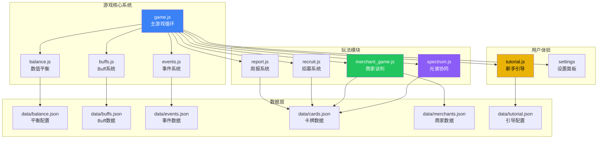
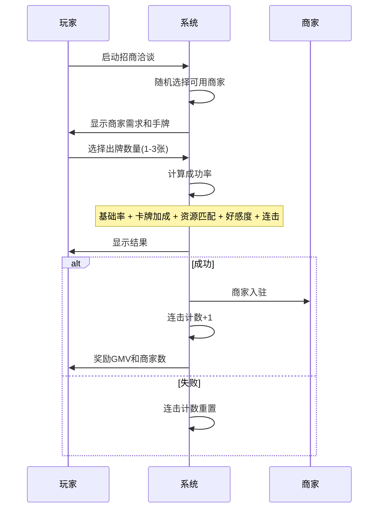

## 1. 高层摘要 (TL;DR)

**影响范围:** 🔴 **高** - 这是一次大规模的游戏系统升级,涉及核心玩法机制、数值平衡和用户体验优化。

**核心变更:**
- ✨ 新增**光谱协同系统**,为卡牌组合提供策略深度
- 🎓 新增**完整的新手引导系统**,降低学习门槛
- ⚖️ 新增**数值平衡配置系统**,统一管理游戏参数
- 🎪 新增**商家谈判小游戏**(B2C模式专属玩法)
- 🎊 新增**季节与节假日事件系统**,丰富游戏内容
- 🔧 新增**卡牌耐久度系统**,增加资源管理策略
- ⚙️ 新增**设置面板**,支持特效开关等个性化配置

---

## 2. 可视化概览 (系统架构图)



---

## 3. 详细变更分析

### 🎨 3.1 CSS样式系统 (css/game.css)

**变更内容:** 新增约440行样式代码,主要包含两大视觉系统

| 样式类别 | 功能描述 | 关键类名 |
|---------|---------|---------|
| **光谱特效** | 为不同光谱的卡牌提供动态视觉反馈 | `.spectrum-technology`, `.spectrum-service`, `.spectrum-design`, `.spectrum-operation` |
| **协同特效** | 展示卡牌组合触发的协同效果 | `.synergy-professional-active`, `.synergy-functional-active`, `.synergy-cross-spectrum-active`, `.synergy-mastery-active` |
| **新手引导** | 引导模态框和高亮样式 | `.tutorial-overlay`, `.tutorial-modal`, `.tutorial-highlight` |
| **特效开关** | 支持禁用动画以提升性能 | `.effect-disabled` |

**代码示例 - 光谱桥梁动画:**
```css
@keyframes spectrum-bridge {
    0%, 100% {
        box-shadow: 0 0 5px var(--spectrum-color),
                    0 0 10px var(--spectrum-color);
    }
    50% {
        box-shadow: 0 0 15px var(--spectrum-color),
                    0 0 30px var(--spectrum-color),
                    0 0 45px var(--spectrum-color);
    }
}
```

---

### 📊 3.2 数据配置文件

#### 3.2.1 Buff系统扩展 (data/buffs.json)

**新增内容:** 432行buff配置

| Buff类型 | 数量 | 示例 |
|---------|------|------|
| **季节性Buff** | 16个 | 艾萨克Q1"花粉过敏"(-3进度)、Q3"秋高气爽"(+3进度) |
| **节假日Buff** | 12个 | 元旦(免基础开销)、春节(进度暂停+士气+5)、国庆(进度暂停) |
| **季节配置** | 4个季度 | Q1(1-6周)、Q2(7-12周)、Q3(13-18周)、Q4(19-24周) |

**关键数据结构:**
```json
{
  "id": "spring_pollen",
  "name": "花粉过敏",
  "type": "negative",
  "character": "aisaike",
  "season": "Q1",
  "effect": {
    "type": "progress",
    "value": -3,
    "duration": 2
  }
}
```

#### 3.2.2 卡牌系统升级 (data/cards.json)

**新增字段:**

| 字段名 | 说明 | 示例值 |
|-------|------|--------|
| `spectrum` | 光谱属性 | `"technology"` |
| `spectrum_color` | 光谱颜色 | `"#3b82f6"` |
| `max_durability` | 最大耐久度 | `10`(R卡)、`8`(SR卡)、`5`(SSR卡) |
| `spectrum_info` | 光谱元数据 | 包含名称、颜色、图标、功能类型 |

**新增配置:**
- **HC里程碑系统:** 资产达到200/500/1000/2000/5000时解锁额外HC
- **方向专属HC:** ToB(客户数)、ToC(DAU)、B2C(GMV)达到阈值解锁HC
- **耐久度规则:** 战败消耗1、谈判失败消耗2、SSR特殊消耗3
- **碎片系统:** R卡报废得1碎片、SR得3、SSR得10
- **合成成本:** R卡50碎片、SR卡100、SSR卡300

#### 3.2.3 事件系统扩展 (data/events.json)

**新增事件类型:** 约1000行事件配置

| 事件类型 | 触发方式 | 数量 |
|---------|---------|------|
| **随机事件** | 概率触发 | 8个通用 + 9个方向专属 |
| **节假日事件** | 固定周数 | 5个(春节、国庆、中秋、元宵、圣诞) |
| **团建事件** | 概率触发 | 6个(每个方向2个) |
| **角色事件** | 概率触发 | 角色专属剧情事件 |

**事件触发条件示例:**
```json
{
  "trigger_condition": {
    "probability": 0.1,
    "min_week": 1,
    "max_week": 52,
    "satisfaction_above": 70,
    "direction": "tob"
  }
}
```

#### 3.2.4 新增配置文件

| 文件名 | 功能 | 关键内容 |
|-------|------|---------|
| **data/balance.json** | 数值平衡配置 | 进度平衡、卡牌平衡、HC平衡、胜利条件、KPI权重 |
| **data/merchants.json** | 商家数据 | 3种商家类型(R/SR/SSR)、10个商家池、谈判规则 |
| **data/negotiation_cards.json** | 谈判卡牌 | 4个光谱池、协同规则、稀有度颜色 |
| **data/tutorial.json** | 新手引导 | 3个方向教程、卡牌教程、提示系统、快速指南 |

---

### 🔧 3.3 JavaScript模块

#### 3.3.1 游戏核心 (js/game.js)

**新增功能:**

| 函数名 | 功能 | 行号 |
|-------|------|------|
| `applyCardWear()` | 卡牌耐久度消耗逻辑 | 1473-1514 |
| `toggleEffectEffects()` | 特效开关控制 | 2749-2762 |
| `showSettingsPanel()` | 显示设置面板 | 2780-2823 |
| `loadSettings()` | 加载用户设置 | 2764-2778 |

**关键逻辑变更:**
```javascript
// 卡牌磨损系统
function applyCardWear(cardId, scenario, success) {
    let wearAmount = 1;
    if (scenario === 'negotiation') {
        wearAmount = success ? 1 : 2;
    } else if (card.rarity === 'SSR') {
        wearAmount = 3;
    }

    card.currentDurability -= wearAmount;

    if (card.currentDurability <= 0) {
        const fragments = card.rarity === 'SSR' ? 10 :
                          (card.rarity === 'SR' ? 3 : 1);
        gameState.cardFragments += fragments;
        backpack.splice(cardIndex, 1);
    }
}
```

**胜利条件重构:** 使用`balance.json`中的加权评分系统,替代硬编码条件

#### 3.3.2 数值平衡模块 (js/balance.js) - 新增

**核心函数:**

| 函数名 | 功能 |
|-------|------|
| `getBalanceConfig()` | 获取平衡配置 |
| `checkHCMilestones()` | 检查HC里程碑并自动解锁 |
| `calculateKPIScore()` | 计算综合KPI评分 |
| `getInterestRate()` | 根据名声获取利率 |
| `getDebtLimit()` | 根据名声获取负债上限 |

**KPI权重配置:**
```javascript
kpi_weights: {
    tob: {
        satisfaction: 0.3,
        progress: 0.25,
        core_kpi: 0.25,  // 标杆客户
        fame: 0.1,
        budget: 0.1
    },
    toc: {
        satisfaction: 0.25,
        progress: 0.2,
        core_kpi: 0.3,   // DAU
        fame: 0.15,
        budget: 0.1
    }
}
```

#### 3.3.3 Buff系统模块 (js/buffs.js) - 新增

**核心功能:**

| 函数名 | 功能 |
|-------|------|
| `checkSeasonBuffs()` | 检查并应用季节性buff |
| `checkHolidayBuffs()` | 检查并应用节假日buff |
| `updateCharacterBuffs()` | 更新角色buff持续时间 |
| `applyCharacterBuffEffects()` | 应用角色buff效果 |

**Buff堆叠规则:**
- 同类型buff: 刷新持续时间
- 不同类型buff: 叠加(最多3个/角色)

#### 3.3.4 事件系统模块 (js/events.js) - 新增

**事件检查函数:**

| 函数名 | 触发事件类型 |
|-------|------------|
| `checkRandomEvents()` | 随机事件(环境/机会/危机/彩蛋) |
| `checkHolidayEvents()` | 节假日事件 |
| `checkTeambuildingEvents()` | 团建事件 |
| `checkCharacterEvents()` | 角色专属事件 |
| `checkChainEvents()` | 连锁事件(最多2次/周) |

**触发条件检查支持:**
- 周数范围、满意度阈值、进度里程碑
- 方向专属、DAU/GMV/客户数阈值
- 名声阈值、特殊条件(低士气/高士气/游戏阶段)

#### 3.3.5 光谱协同模块 (js/spectrum.js) - 新增

**协同类型与加成:**

| 协同类型 | 触发条件 | 加成倍率 |
|---------|---------|---------|
| **职业协同** | 员工卡 + 对应功能谈判卡 | ×1.5 |
| **功能协同** | 同光谱卡牌×2 | ×1.5 |
| **跨光谱** | 四种光谱各至少1张 | ×2.0 |
| **职业专精** | 同职业员工≥2张 | ×2.0 |

**视觉反馈:**
```javascript
function showSynergyNotification(type, multiplier, details) {
    // 创建通知元素
    // 根据类型显示不同样式和文本
    // 3秒后自动移除
}
```

#### 3.3.6 商家谈判游戏 (js/merchant_game.js) - 新增

**游戏流程:**



**成功率计算公式:**
```
最终成功率 = 基础成功率
           + 卡牌效果加成
           + 资源匹配加成(每项满足+15%)
           + 小葵好感加成(≥80时+10%)
           + 连击加成(连续成功×5%,最高+15%)
```

#### 3.3.7 新手引导模块 (js/tutorial.js) - 新增

**引导结构:**

| 引导类型 | 步骤数 | 内容 |
|---------|-------|------|
| **通用引导** | 2步 | 选择方向、选择团队 |
| **ToB引导** | 5步 | KPI、周报、招募、融资、胜利条件 |
| **ToC引导** | 5步 | KPI、迭代、扩充、商家合作、胜利条件 |
| **B2C引导** | 5步 | KPI、运营、招商、光谱系统、胜利条件 |
| **卡牌引导** | 3步 | 稀有度、光谱、耐久度 |

**提示系统:**
- 7条游戏技巧提示
- 根据触发条件自动显示
- 防重复显示机制

**快速指南:**
- 5个常见问题FAQ
- 可折叠的问答界面

#### 3.3.8 招募系统升级 (js/recruit.js)

**抽卡成本计算重构:**
```javascript
function getCurrentDrawCost() {
    const fameCoefficient = getDrawCostMultiplier();  // 名声系数
    const capitalCoefficient = 1.0 + (budget / capitalThreshold) * 0.5;  // 资金系数
    const multiplier = fameCoefficient * capitalCoefficient;
    return Math.round(baseCost * multiplier);
}
```

**卡牌使用集成磨损系统:**
- 调用`applyCardWear()`处理耐久度
- 报废时返还碎片
- 更新UI显示

#### 3.3.9 周报系统升级 (js/report.js)

**变更内容:**
- 集成卡牌磨损系统
- 战败时消耗耐久度
- 移除旧的耐久度处理逻辑

---

### 🖥️ 3.4 HTML结构更新 (game.html)

**新增按钮:**
```html
<div class="header-buttons">
    <button class="btn-back-home" id="btn-back-home">🏠 返回主页</button>
    <button class="btn-settings" onclick="showSettingsPanel()">⚙️ 设置</button>
    <button class="btn-help" onclick="showQuickGuide()">❓ 帮助</button>
</div>
```

**新增脚本引入:**
```html
<script src="js/buffs.js"></script>
<script src="js/balance.js"></script>
<script src="js/spectrum.js"></script>
<script src="js/events.js"></script>
<script src="js/tutorial.js"></script>
```

---

## 4. 影响与风险评估

### ⚠️ 4.1 破坏性变更

| 变更项 | 旧行为 | 新行为 | 影响范围 |
|-------|-------|-------|---------|
| **基础进度** | 每周+5% | 每周+3% | 所有游戏进程 |
| **卡牌耐久度** | 无限制 | R=10次, SR=8次, SSR=5次 | 所有卡牌使用 |
| **胜利条件** | 硬编码 | 使用balance.json配置 | 所有游戏结局 |
| **抽卡成本** | 固定10 | 动态计算(名声×资金) | 招募系统 |

### 🧪 4.2 测试建议

**核心功能测试:**
1. ✅ **新手引导:** 测试三个方向的完整引导流程
2. ✅ **光谱协同:** 验证四种协同类型的触发和加成
3. ✅ **卡牌磨损:** 测试不同场景下的耐久度消耗
4. ✅ **商家谈判:** 测试B2C模式的招商小游戏
5. ✅ **事件系统:** 测试随机事件、节假日事件、团建事件
6. ✅ **Buff系统:** 测试季节buff和节假日buff的叠加

**边界条件测试:**
- 卡牌耐久度耗尽时的碎片返还
- HC里程碑解锁时的HC增加
- 连击系统的计数和重置
- 设置面板的持久化存储

**性能测试:**
- 特效开关对性能的影响
- 大量事件触发时的响应速度
- 光谱动画的流畅度

### 📝 4.3 兼容性说明

- **LocalStorage:** 新增`game_settings`、`fair_office_combo_count`等存储键
- **游戏存档:** 需要迁移旧存档以支持新字段(如`cardFragments`、`tutorialProgress`)
- **浏览器兼容:** 使用ES6+语法,需现代浏览器支持

---

## 5. 总结

这次更新是游戏自发布以来**最大规模的一次系统升级**,主要实现了:

1. **深度策略性:** 光谱协同系统和卡牌耐久度系统大幅提升了游戏的策略深度
2. **用户友好性:** 完整的新手引导和快速指南大幅降低了学习门槛
3. **可维护性:** 数值配置外部化(balance.json)使得平衡调整更加灵活
4. **内容丰富度:** 季节/节假日事件、商家谈判小游戏等新增内容提升了游戏可玩性
5. **性能优化:** 特效开关允许低配置设备关闭动画

**建议后续工作:**
- 完善旧存档的迁移逻辑
- 添加更多光谱协同组合的视觉反馈
- 优化事件系统的触发频率和平衡性
- 为B2C模式添加更多商家类型和谈判策略
